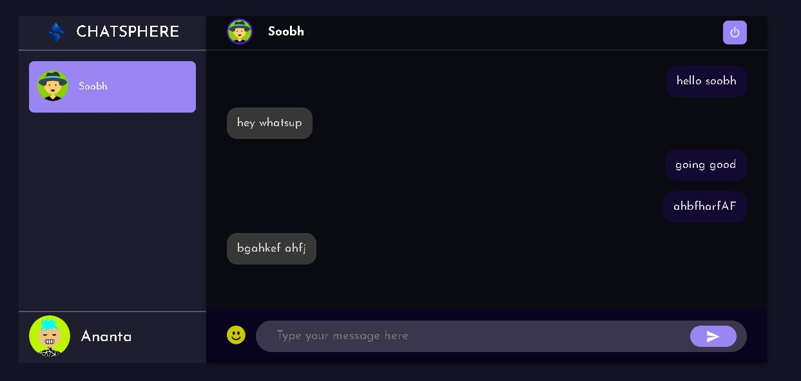
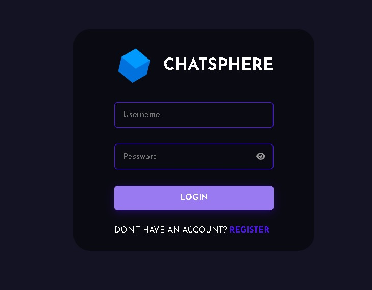
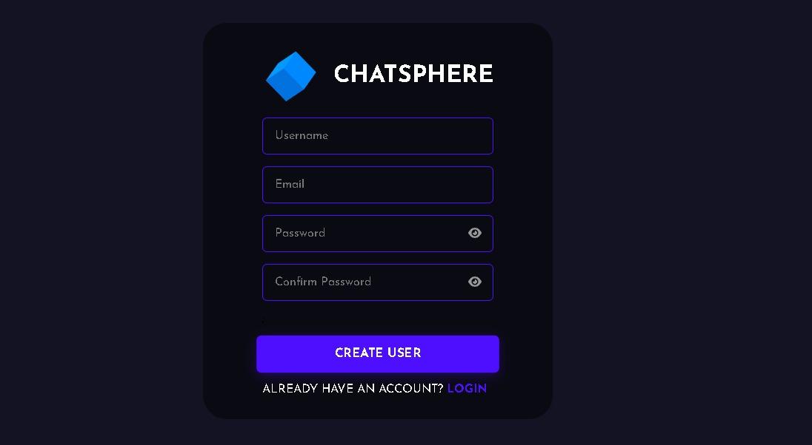

# 🌐 ChatSphere - Real-time Chat Application

Welcome to **ChatSphere**! 🎉 This is a real-time chat application built using **Sockets.io** for live messaging, **React** for the frontend, and **Node.js & Express** for the backend. 🚀

## ✨ Features

- 🔥 **Real-time Messaging**: Instant communication with your friends and teams.
- 🧑‍💻 **User Authentication**: Includes **Register** and **Login** functionality to manage users.
- 🖼️ **Set Avatar**: Users can personalize their profile by setting a unique avatar during registration.
- 🔒 **Logout Feature**: Easily log out when you're done chatting, ensuring your account is secure.


- 🛠️ **Scalable Backend**: Powered by Node.js and Express for fast, scalable service.
- 📱 **Responsive Design**: Seamless chat experience across all devices.

## 🖥️ Tech Stack

- **Frontend**: React.js ⚛️
- **Backend**: Node.js with Express.js ⚙️
- **Real-time Communication**: Socket.io 🟢
- **Styling**: CSS / Styled Components 🎨
- **Database**: MongoDB🗄️

## 📸 Screenshots

Here's a sneak peek of **ChatSphere** in action:


> **Figure 1:** Chat Page of ChatSphere


> **Figure 2:** Login Page of ChatSphere


> **Figure 3:** Register Page of ChatSphere

# ChatSphere

**Demo Video**:

https://github.com/user-attachments/assets/f67eb645-2bf9-4060-9211-f38e4be0a509


> **Note**: Currently, ChatSphere is not deployed online yet. 🚧 However, you can run it locally by following the instructions below.

## 🚀 Getting Started

Follow these instructions to get a copy of **ChatSphere** up and running on your local machine for development and testing purposes.

### 📦 Installation

1. Clone the repository:

   ```bash
   git clone https://github.com/your-username/chatsphere.git
   cd chatsphere
   ```
2. Install dependencies for the backend:
   ```
   cd server
   npm install
   ```
3. Install dependencies for the frontend:
   ```
   cd public
   npm install
   ```
4. ⚙️ Running the Application<br/>
   Open 2 terminals for better accessibility<br/>
   ## For frontend:<br/>
   Go to the public folder and type **yarn start** to start the frontend<br/>
   ## For backend:<br/>
   Go to the server folder and type **nodemon index.js** to start the backend<br/>
   ## For socket server:<br/>
   Ensure your socket server is running alongside the backend.


   

## 🌍 Environment Variables:-
To run this project, you will need to add the following environment variables in a .env file in the server directory:
```
PORT=5000
MONGO_URI=your_mongo_db_connection_string

```

## ✉️ Contact:-

GitHub: [Ananta2545](https://github.com/Ananta2545)<br/>
Email: chatterjeeanata091@gmail.com

Thanks for visiting chatsphere!!.. 🥰🥰


  


